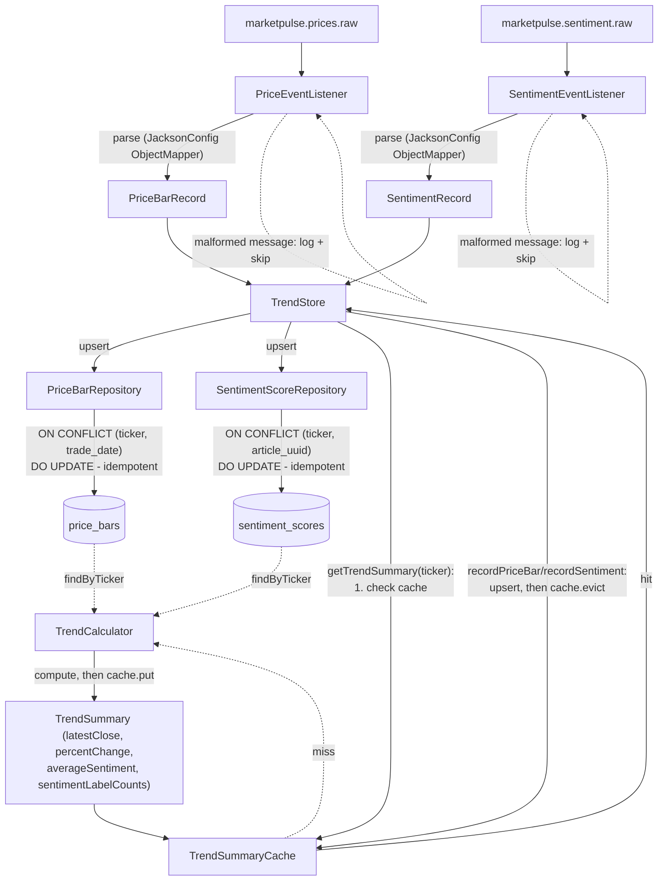

# Architecture: Aggregation Service

**Fits into:** [system overview](system-overview.md) · **Reference:** [aggregation service reference doc](../reference/aggregation-service.md)

## Consumer flow

Both listeners are thin: parse the message, delegate to `TrendStore`. A malformed message is logged and skipped — never thrown, so it can't stop the listener from processing the rest of the topic. `TrendCalculator` is a pure, stateless function from stored history to a `TrendSummary`, independently unit-testable with no Spring context, and it did not change at all when storage moved from in-memory maps to PostgreSQL (see [postgres-persistence-layer](../user-stories/postgres-persistence-layer.md)) or when Redis caching was added in front of it (see [redis-caching-layer](../user-stories/redis-caching-layer.md)).

| Module | Responsibility |
|---|---|
| `trend/PriceBarRecord.java`, `trend/SentimentRecord.java` | Domain records shared between the storage layer and `TrendCalculator` |
| `trend/TrendSummary.java` | Computed output — latest close, percent change, average sentiment, label counts |
| `trend/TrendCalculator.java` | Pure computation, no I/O, no Spring |
| `trend/TrendStore.java` | Orchestrates: checks the cache, delegates writes/reads to the repositories, hands query results to `TrendCalculator`, evicts the cache on every write |
| `trend/TrendSummaryCache.java` | Redis-backed cache of computed `TrendSummary` values, keyed by ticker — every operation is defensive (see below) |
| `persistence/PriceBarRepository.java`, `persistence/SentimentScoreRepository.java` | Plain JDBC (`NamedParameterJdbcTemplate`) upsert + query against PostgreSQL |
| `kafka/PriceEventListener.java`, `kafka/SentimentEventListener.java` | Thin `@KafkaListener`s — parse, delegate, isolate failures |
| `kafka/dto/*` | Jackson-mapped DTOs for the two Kafka JSON schemas |
| `config/JacksonConfig.java` | Explicit `ObjectMapper` bean (see reference doc's Known Limitations for why this was needed) |

## Why the cache can never break correctness or availability

Postgres is the source of truth; Redis is purely a read-performance optimization. `TrendSummaryCache` wraps every Redis call in a try/catch that logs and returns/no-ops rather than propagating — proven live, not just claimed: with the Redis container stopped outright, `AggregationServiceIntegrationTest`'s full Kafka → listener → Postgres → `TrendSummary` flow still passed, with real `RedisConnectionFailureException`s visible in the logs at every cache read/write/eviction attempt. A service that's otherwise healthy but has a down cache keeps working; it doesn't get slower or fail requests, it just always takes the cache-miss path.

Consistency uses invalidate-on-write, not a TTL alone: `recordPriceBar`/`recordSentiment` evict the ticker's cache entry on every write, so a cache hit is never older than the most recent Kafka message processed for that ticker. The 5-minute TTL on cached entries exists only as a safety net for a missed eviction, not as the primary mechanism — this system ingests real-time data continuously, so relying on a fixed expiry alone would mean serving stale trend summaries for up to that whole window after new data arrives.

## Why idempotent-by-storage, not deduplication tracking

Kafka delivery is at-least-once — any consumer must expect redelivery. Rather than tracking "have I seen this message before," both repositories upsert on a composite primary key naturally unique to the *content* (`(ticker, trade_date)` for price bars, `(ticker, article_uuid)` for sentiment): reprocessing the same message overwrites the same row with the same value, which is a no-op in effect. `TrendCalculator.compute()` then always recomputes fresh from a full re-query of stored state rather than maintaining an incremental running average — this is what avoids a redelivered sentiment score silently double-counting toward the average. This was originally enforced by `TrendStore`'s in-memory map keys; moving to Postgres just moved the same guarantee down into the schema's primary key + `ON CONFLICT`.

## Why a long-running service, not a bounded batch

Unlike the Python components (deliberately bounded/batch — see their own architecture docs), `@KafkaListener` is Spring Kafka's idiomatic continuous-consumption model, and a persistently-running Aggregation Service is the actual target shape per the [root README](../../README.md#architecture) — there was no reason to fight that here the way the Python demo scripts intentionally did.
