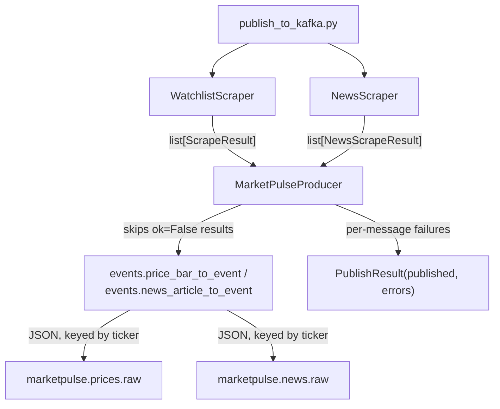
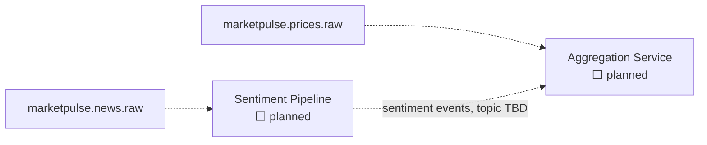

# Architecture: Event Stream

**Fits into:** [system overview](system-overview.md) · **Reference:** [event stream reference doc](../reference/event-stream.md)

## Producer flow

`MarketPulseProducer` only publishes data from results where `ok=True` — a scraper-level failure for a ticker never becomes a Kafka message. A publish failure for one message is caught and recorded in `PublishResult.errors`, not raised, so it never stops the rest of the batch — the same per-item isolation used throughout the scraper.

| Module | Responsibility |
|---|---|
| `events.py` | Defines topic names, `schema_version`, and serializes `PriceBar`/`NewsArticle` into the JSON event schema |
| `kafka_producer.py` | `MarketPulseProducer` — publishes a batch of scrape results, isolating per-message failures into `PublishResult` |

## Downstream (not built yet)

No consumers exist yet. When the sentiment pipeline is built, it will consume `marketpulse.news.raw` and produce its own sentiment-scored events (topic name and schema to be defined as part of that story); the Aggregation Service will consume both raw prices and sentiment events to compute trends.
