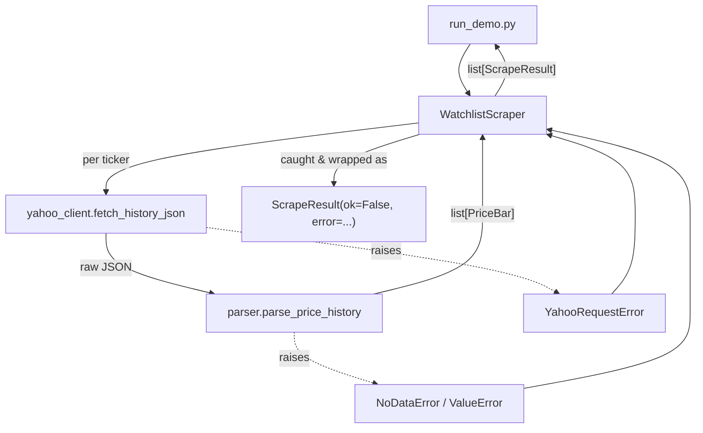

# Architecture: Scraper Service

**Fits into:** [system overview](system-overview.md) · **Reference:** [scraper reference doc](../reference/scraper.md)

## Internal module design

`WatchlistScraper` catches every failure mode from the client and parser and turns it into a `ScrapeResult` for that ticker, so a single ticker's problem never propagates as an exception out of `fetch_history()`.

| Module | Responsibility |
|---|---|
| `models.py` | `PriceBar` — one day of OHLCV data |
| `yahoo_client.py` | HTTP I/O against Yahoo Finance's public chart endpoint |
| `parser.py` | Turns the raw JSON payload into `PriceBar` rows; detects "no data" vs. malformed data |
| `watchlist.py` | `WatchlistScraper` — orchestrates the batch, isolates per-ticker failures into `ScrapeResult` |
