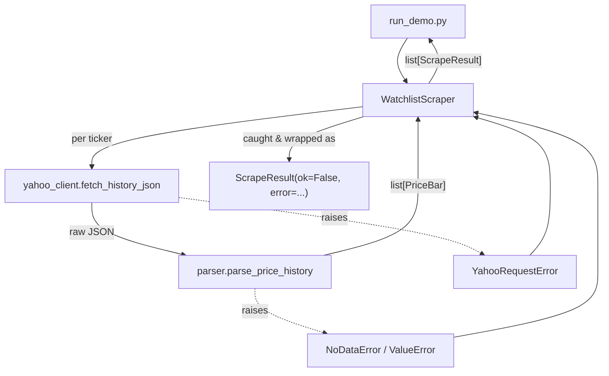
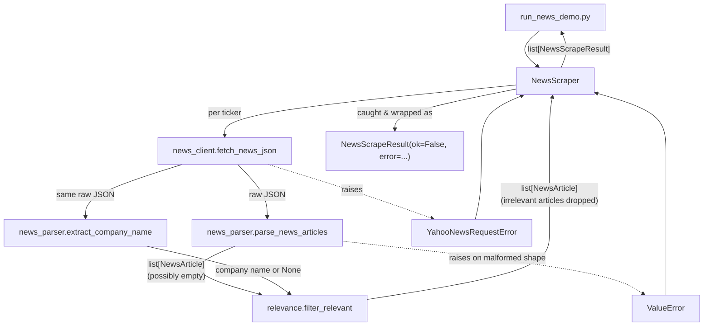

# Architecture: Scraper Service

**Fits into:** [system overview](system-overview.md) · **Reference:** [scraper reference doc](../reference/scraper.md)

## Price ingestion module design

`WatchlistScraper` catches every failure mode from the client and parser and turns it into a `ScrapeResult` for that ticker, so a single ticker's problem never propagates as an exception out of `fetch_history()`.

| Module | Responsibility |
|---|---|
| `models.py` | `PriceBar` — one day of OHLCV data |
| `yahoo_client.py` | HTTP I/O against Yahoo Finance's public chart endpoint |
| `parser.py` | Turns the raw JSON payload into `PriceBar` rows; detects "no data" vs. malformed data |
| `watchlist.py` | `WatchlistScraper` — orchestrates the batch, isolates per-ticker failures into `ScrapeResult` |

## News ingestion module design

Mirrors the price ingestion design (same client/parser/orchestrator split, same per-ticker error isolation), with two deliberate differences:
1. An empty `articles` list from the parser (or after relevance filtering) is a **successful** `NewsScrapeResult` (`ok=True`), not an error — absence of news is normal, unlike absent price history.
2. A relevance-filtering step sits between parsing and the result: it uses the same response payload's `quotes` array (no extra HTTP call) to resolve the ticker's company name, then keeps only articles whose title mentions the ticker or company name. An unresolvable ticker (no matching quote) has no company name to match against, so it naturally filters down to an empty list instead of keeping the source's generic/trending fallback articles.

| Module | Responsibility |
|---|---|
| `models.py` | `NewsArticle` — one news item for a ticker |
| `news_client.py` | HTTP I/O against Yahoo Finance's public search endpoint |
| `news_parser.py` | Turns the raw JSON payload into `NewsArticle` rows; skips individual malformed articles, raises only on a malformed response shape. Also resolves a ticker's company name from the same payload's `quotes` array. |
| `relevance.py` | Filters articles to ones whose title mentions the ticker symbol or company name (whole-word, case-insensitive, tolerant of corporate suffixes) |
| `news_scraper.py` | `NewsScraper` — orchestrates the batch: fetch → parse → filter, isolates per-ticker failures into `NewsScrapeResult` |
