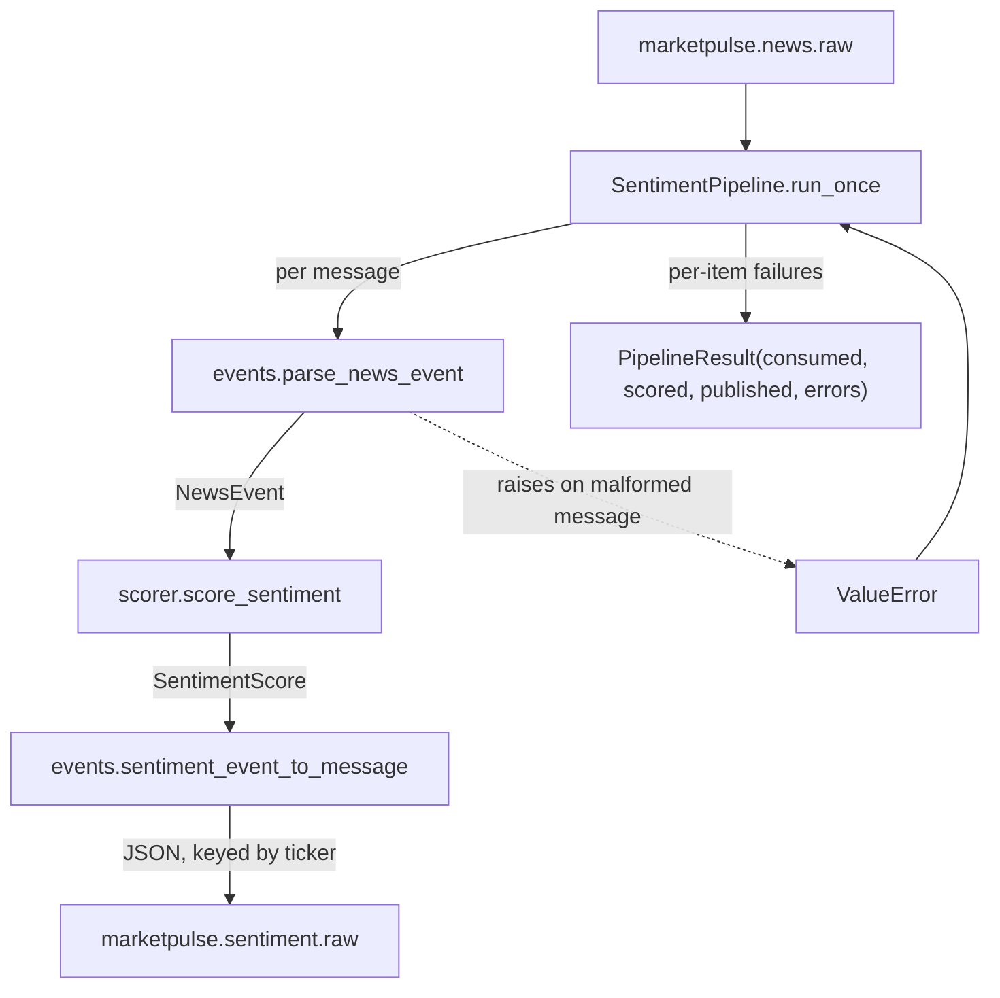

# Architecture: Sentiment Pipeline

**Fits into:** [system overview](system-overview.md) · **Reference:** [sentiment pipeline reference doc](../reference/sentiment-pipeline.md)

## Pipeline flow

`SentimentPipeline` deliberately does not import anything from the `scraper/` package — `parse_news_event` only knows about the documented `marketpulse.news.raw` JSON shape, not the scraper's `NewsArticle` dataclass. A malformed message is recorded as an error and skipped; it never crashes the batch or gets published as a broken sentiment event.

| Module | Responsibility |
|---|---|
| `models.py` | `NewsEvent` (parsed input), `SentimentScore`, `SentimentEvent` (scored output) |
| `scorer.py` | `score_sentiment` — VADER + a small finance-specific lexicon supplement |
| `events.py` | Parses `marketpulse.news.raw` messages, serializes `marketpulse.sentiment.raw` messages |
| `pipeline.py` | `SentimentPipeline` — consumes a bounded batch, scores it, publishes results |

## Why bounded batches, not a daemon

`run_once()` consumes whatever's currently on the topic (bounded by `consumer_timeout_ms`) and returns — it does not run forever. This matches the pattern already used for the Kafka producer CLI (`scraper/publish_to_kafka.py`). Turning this into a long-running, restart-on-crash service is a deployment concern, not part of scoring logic — revisit once there's an actual deployment story for MarketPulse's services.
