# Architecture: System Overview

Component breakdown and tech choices: see the [root README](../../README.md#architecture).

## Data flow

```mermaid
flowchart LR
    subgraph Implemented
        WL[Watchlist config] --> SC["Scraper Service (Python)"]
    end
    subgraph Planned
        SC -.-> KAFKA[(Kafka: raw price + sentiment events)]
        NEWS[News scraping] -.-> KAFKA
        KAFKA -.-> AGG["Aggregation Service (Spring Boot)"]
        AGG -.-> PG[(PostgreSQL)]
        AGG -.-> REDIS[(Redis cache)]
        AGG -.-> API["REST API"]
    end
```

Solid arrows are built and tested; dashed arrows are planned — see the [roadmap](../../README.md#roadmap).

## Component-level diagrams

- [Scraper Service internals](scraper.md)
