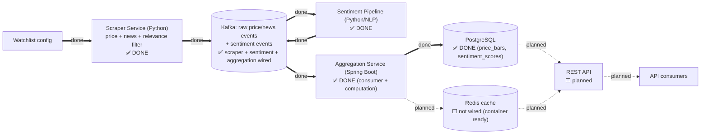

# Architecture: System Overview

**This is the canonical build-status diagram** — the single place that shows what's actually built vs. still planned across all of MarketPulse. Component breakdown and tech choices: see the [root README](../../README.md#architecture); this doc is kept in sync with the [roadmap](../../README.md#roadmap) there.

## Data flow

Solid arrow (`==>`) = built and tested. Dashed arrows (`-.->`) = planned, not yet wired. The scraper publishes price/news events; the sentiment pipeline consumes news and publishes sentiment events back onto Kafka; the Aggregation Service consumes both and durably persists trend data to PostgreSQL — verified surviving an actual process restart. Redis is still just a runnable container with no application code talking to it (row 9), and nothing is queryable via HTTP yet (row 10).

## Build status

| # | Component / capability | Status | Docs |
|---|---|---|---|
| 1 | Scraper — price ingestion | ✅ Done | [reference/scraper.md](../reference/scraper.md) |
| 2 | Scraper — news ingestion | ✅ Done | [reference/scraper.md](../reference/scraper.md) |
| 3 | Scraper — news relevance filtering | ✅ Done | [reference/scraper.md](../reference/scraper.md) |
| 4 | Docker Compose for local dev (Kafka/Postgres/Redis) | ✅ Done | [reference/local-dev.md](../reference/local-dev.md) |
| 5 | Kafka event schema + producers | ✅ Done | [reference/event-stream.md](../reference/event-stream.md) |
| 6 | Sentiment scoring pipeline | ✅ Done | [reference/sentiment-pipeline.md](../reference/sentiment-pipeline.md) |
| 7 | Aggregation service consumer + trend computation | ✅ Done | [reference/aggregation-service.md](../reference/aggregation-service.md) |
| 8 | PostgreSQL schema + persistence layer | ✅ Done | [reference/aggregation-service.md](../reference/aggregation-service.md) |
| 9 | Redis caching layer | ⬜ Not started | — |
| 10 | REST API | ⬜ Not started | — |

Rows 4–10 mirror the [root README's roadmap](../../README.md#roadmap) exactly — check both when either changes.

### Rough build order

Items 5–10 have real dependencies on each other; 4 and 6 are more independent:

- **4 (Docker Compose)** has no code dependency on anything else, but 5, 7, 8, and 9 all need a real Kafka/Postgres/Redis to test against — doing this first unblocked the rest of local development.
- **6 (Sentiment pipeline)** consumes Kafka's news topic and publishes back to it — done, and fully decoupled from the scraper's own code (only depends on the documented `marketpulse.news.raw` schema).
- **7 (Aggregation Service)** and **8 (Postgres persistence)** — both done: a real Spring Boot Kafka consumer computing trend summaries, now durably persisted (verified surviving a real process kill + restart). Same decoupling principle as the sentiment pipeline — no code dependency on the Python components, only on the documented Kafka schemas.
- **9 → 10** is what's left: Redis caching needs to exist before the REST API can read from it (or the API could read Postgres directly and add caching later — an open question for that story).

## Component-level diagrams

- [Scraper Service internals](scraper.md)
- [Event Stream internals](event-stream.md)
- [Sentiment Pipeline internals](sentiment-pipeline.md)
- [Aggregation Service internals](aggregation-service.md)
