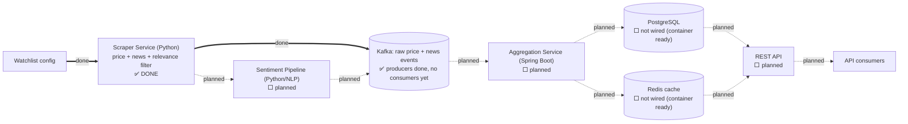

# Architecture: System Overview

**This is the canonical build-status diagram** — the single place that shows what's actually built vs. still planned across all of MarketPulse. Component breakdown and tech choices: see the [root README](../../README.md#architecture); this doc is kept in sync with the [roadmap](../../README.md#roadmap) there.

## Data flow

Solid arrow (`==>`) = built and tested. Dashed arrows (`-.->`) = planned, not yet wired. The scraper now publishes real price/news events onto Kafka (row 5 below) — but nothing consumes them yet, and Postgres/Redis are still just runnable containers with no application code talking to them (rows 7, 8, 9).

## Build status

| # | Component / capability | Status | Docs |
|---|---|---|---|
| 1 | Scraper — price ingestion | ✅ Done | [reference/scraper.md](../reference/scraper.md) |
| 2 | Scraper — news ingestion | ✅ Done | [reference/scraper.md](../reference/scraper.md) |
| 3 | Scraper — news relevance filtering | ✅ Done | [reference/scraper.md](../reference/scraper.md) |
| 4 | Docker Compose for local dev (Kafka/Postgres/Redis) | ✅ Done | [reference/local-dev.md](../reference/local-dev.md) |
| 5 | Kafka event schema + producers | ✅ Done | [reference/event-stream.md](../reference/event-stream.md) |
| 6 | Sentiment scoring pipeline | ⬜ Not started | — |
| 7 | Aggregation service consumer + trend computation | ⬜ Not started | — |
| 8 | PostgreSQL schema + persistence layer | ⬜ Not started | — |
| 9 | Redis caching layer | ⬜ Not started | — |
| 10 | REST API | ⬜ Not started | — |

Rows 4–10 mirror the [root README's roadmap](../../README.md#roadmap) exactly — check both when either changes.

### Rough build order

Items 5–10 have real dependencies on each other; 4 and 6 are more independent:

- **4 (Docker Compose)** has no code dependency on anything else, but 5, 7, 8, and 9 all need a real Kafka/Postgres/Redis to test against — doing this first unblocks the rest of local development.
- **6 (Sentiment pipeline)** only depends on the scraper's news output (done) — it doesn't need Kafka to exist to be built and tested standalone, only to be *wired in*.
- **5 → 7 → (8 and 9) → 10** is a hard chain: producers need a schema before Aggregation can consume anything; Aggregation needs to exist before persistence/caching have a caller; the API reads from Postgres/Redis, so it comes last.

## Component-level diagrams

- [Scraper Service internals](scraper.md)
- [Event Stream internals](event-stream.md)
