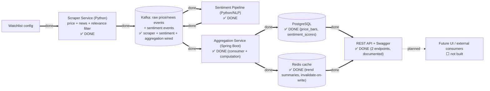

# Architecture: System Overview

**This is the canonical build-status diagram** — the single place that shows what's actually built vs. still planned across all of MarketPulse. Component breakdown and tech choices: see the [root README](../../README.md#architecture); this doc is kept in sync with the [roadmap](../../README.md#roadmap) there.

## Data flow

Solid arrow (`==>`) = built and tested. Dashed arrows (`-.->`) = planned, not yet wired. Every roadmap item is now built end to end: scraper → Kafka → sentiment pipeline → Aggregation Service (Postgres-persisted, Redis-cached) → REST API, live-testable via Swagger UI at `/swagger-ui/index.html`. The only thing left is something to actually *call* that API from the outside — a UI or other consumer, not yet built.

## Build status

| # | Component / capability | Status | Docs |
|---|---|---|---|
| 1 | Scraper — price ingestion | ✅ Done | [reference/scraper.md](../reference/scraper.md) |
| 2 | Scraper — news ingestion | ✅ Done | [reference/scraper.md](../reference/scraper.md) |
| 3 | Scraper — news relevance filtering | ✅ Done | [reference/scraper.md](../reference/scraper.md) |
| 4 | Docker Compose for local dev (Kafka/Postgres/Redis) | ✅ Done | [reference/local-dev.md](../reference/local-dev.md) |
| 5 | Kafka event schema + producers | ✅ Done | [reference/event-stream.md](../reference/event-stream.md) |
| 6 | Sentiment scoring pipeline | ✅ Done | [reference/sentiment-pipeline.md](../reference/sentiment-pipeline.md) |
| 7 | Aggregation service consumer + trend computation | ✅ Done | [reference/aggregation-service.md](../reference/aggregation-service.md) |
| 8 | PostgreSQL schema + persistence layer | ✅ Done | [reference/aggregation-service.md](../reference/aggregation-service.md) |
| 9 | Redis caching layer | ✅ Done | [reference/aggregation-service.md](../reference/aggregation-service.md) |
| 10 | REST API | ✅ Done | [reference/aggregation-service.md](../reference/aggregation-service.md) |

**All 10 roadmap items are done.** Rows 4–10 mirror the [root README's roadmap](../../README.md#roadmap) exactly — check both when either changes. What's next isn't on this list yet: something to actually *consume* the API (a UI, most likely) — see the root README for that conversation.

### Build order, for the record

Items 5–10 had real dependencies on each other; 4 and 6 were more independent:

- **4 (Docker Compose)** had no code dependency on anything else, but 5, 7, 8, and 9 all needed a real Kafka/Postgres/Redis to test against — doing this first unblocked the rest of local development.
- **6 (Sentiment pipeline)** consumes Kafka's news topic and publishes back to it — fully decoupled from the scraper's own code (only depends on the documented `marketpulse.news.raw` schema).
- **7 (Aggregation Service), 8 (Postgres persistence), and 9 (Redis caching)**: a real Spring Boot Kafka consumer computing trend summaries, durably persisted (verified surviving a real process kill + restart), cached in front of Postgres with invalidate-on-write consistency (verified degrading gracefully with Redis stopped outright — cache down means slower, never wrong or broken). Same decoupling principle as the sentiment pipeline throughout — no code dependency on the Python components, only on the documented Kafka schemas.
- **10 (REST API)** came last, now that there was real durable/cached data for it to expose — two endpoints, documented and testable via Swagger UI.

## Component-level diagrams

- [Scraper Service internals](scraper.md)
- [Event Stream internals](event-stream.md)
- [Sentiment Pipeline internals](sentiment-pipeline.md)
- [Aggregation Service internals](aggregation-service.md)
